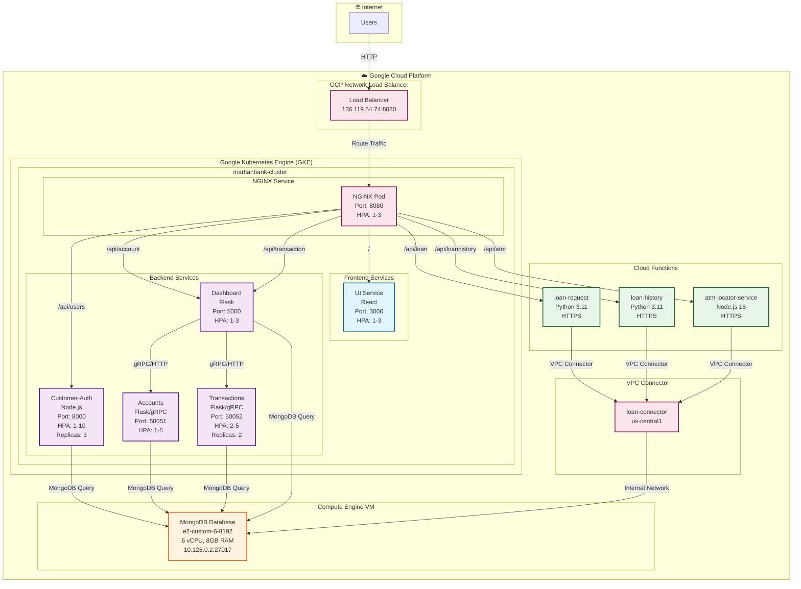
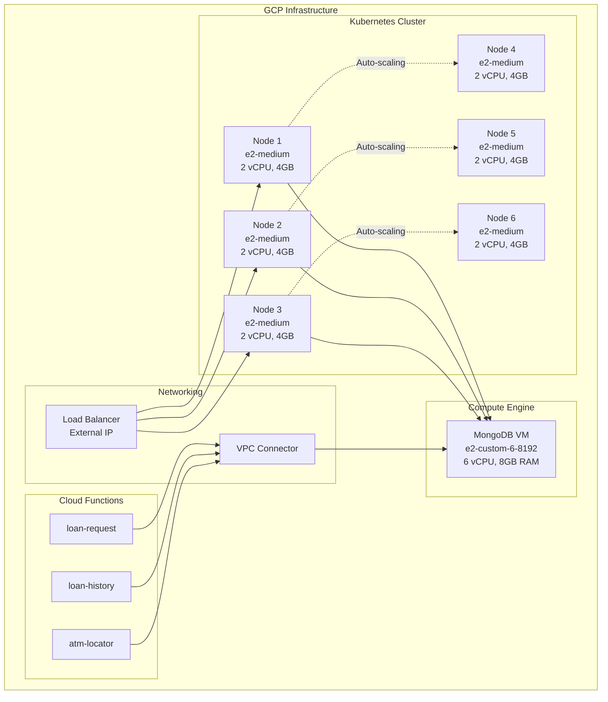

# Martian Bank - Detailed Architecture Diagram

## System Architecture (Mermaid)

```mermaid
graph TB
    subgraph Internet["🌐 Internet"]
        Users["Users"]
    end

    subgraph GCP["☁️ Google Cloud Platform"]
        subgraph LB["GCP Network Load Balancer"]
            LoadBalancer["Load Balancer<br/>136.119.54.74:8080"]
        end

        subgraph GKE["Google Kubernetes Engine (GKE)"]
            subgraph Cluster["martianbank-cluster<br/>3-6 nodes (auto-scaling)"]
                subgraph NginxPod["NGINX Service"]
                    Nginx["NGINX Pod<br/>Port: 8080<br/>HPA: 1-3"]
                end

                subgraph Frontend["Frontend Services"]
                    UI["UI Service<br/>React<br/>Port: 3000<br/>HPA: 1-3"]
                end

                subgraph Backend["Backend Services"]
                    Auth["Customer-Auth<br/>Node.js<br/>Port: 8000<br/>HPA: 1-10<br/>Replicas: 3"]
                    Dashboard["Dashboard<br/>Flask<br/>Port: 5000<br/>HPA: 1-3"]
                    Accounts["Accounts<br/>Flask/gRPC<br/>Port: 50051<br/>HPA: 1-5"]
                    Transactions["Transactions<br/>Flask/gRPC<br/>Port: 50052<br/>HPA: 2-5<br/>Replicas: 2"]
                end
            end
        end

        subgraph VM["Compute Engine VM"]
            MongoDB["MongoDB Database<br/>e2-custom-6-8192<br/>6 vCPU, 8GB RAM<br/>10.128.0.2:27017"]
        end

        subgraph CF["Cloud Functions"]
            LoanRequest["loan-request<br/>Python 3.11<br/>HTTPS"]
            LoanHistory["loan-history<br/>Python 3.11<br/>HTTPS"]
            ATMLocator["atm-locator-service<br/>Node.js 18<br/>HTTPS"]
        end

        subgraph VPC["VPC Connector"]
            VPCConnector["loan-connector<br/>us-central1"]
        end
    end

    %% User to Load Balancer
    Users -->|HTTP| LoadBalancer

    %% Load Balancer to NGINX
    LoadBalancer -->|Route Traffic| Nginx

    %% NGINX to Services
    Nginx -->|"/"| UI
    Nginx -->|"/api/users"| Auth
    Nginx -->|"/api/account"| Dashboard
    Nginx -->|"/api/transaction"| Dashboard
    Nginx -->|"/api/loan"| LoanRequest
    Nginx -->|"/api/loanhistory"| LoanHistory
    Nginx -->|"/api/atm"| ATMLocator

    %% Dashboard to Backend Services
    Dashboard -->|gRPC/HTTP| Accounts
    Dashboard -->|gRPC/HTTP| Transactions

    %% Services to MongoDB
    Auth -->|MongoDB Query| MongoDB
    Accounts -->|MongoDB Query| MongoDB
    Transactions -->|MongoDB Query| MongoDB
    Dashboard -->|MongoDB Query| MongoDB

    %% Cloud Functions to MongoDB via VPC
    LoanRequest -->|VPC Connector| VPCConnector
    LoanHistory -->|VPC Connector| VPCConnector
    ATMLocator -->|VPC Connector| VPCConnector
    VPCConnector -->|Internal Network| MongoDB

    %% Styling
    classDef frontend fill:#e1f5ff,stroke:#01579b,stroke-width:2px
    classDef backend fill:#f3e5f5,stroke:#4a148c,stroke-width:2px
    classDef database fill:#fff3e0,stroke:#e65100,stroke-width:2px
    classDef serverless fill:#e8f5e9,stroke:#1b5e20,stroke-width:2px
    classDef infrastructure fill:#fce4ec,stroke:#880e4f,stroke-width:2px

    class UI frontend
    class Auth,Dashboard,Accounts,Transactions backend
    class MongoDB database
    class LoanRequest,LoanHistory,ATMLocator serverless
    class LoadBalancer,Nginx,VPCConnector infrastructure
```
## Infrastructure Components

```mermaid
graph TB
    subgraph "GCP Infrastructure"
        subgraph "Kubernetes Cluster"
            Node1[Node 1<br/>e2-medium<br/>2 vCPU, 4GB]
            Node2[Node 2<br/>e2-medium<br/>2 vCPU, 4GB]
            Node3[Node 3<br/>e2-medium<br/>2 vCPU, 4GB]
            Node4[Node 4<br/>e2-medium<br/>2 vCPU, 4GB]
            Node5[Node 5<br/>e2-medium<br/>2 vCPU, 4GB]
            Node6[Node 6<br/>e2-medium<br/>2 vCPU, 4GB]
        end

        subgraph "Compute Engine"
            MongoDBVM[MongoDB VM<br/>e2-custom-6-8192<br/>6 vCPU, 8GB RAM]
        end

        subgraph "Cloud Functions"
            CF1[loan-request]
            CF2[loan-history]
            CF3[atm-locator]
        end

        subgraph "Networking"
            LB[Load Balancer<br/>External IP]
            VPC[VPC Connector]
        end
    end

    LB --> Node1
    LB --> Node2
    LB --> Node3
    Node1 -.->|Auto-scaling| Node4
    Node2 -.->|Auto-scaling| Node5
    Node3 -.->|Auto-scaling| Node6

    Node1 --> MongoDBVM
    Node2 --> MongoDBVM
    Node3 --> MongoDBVM

    CF1 --> VPC
    CF2 --> VPC
    CF3 --> VPC
    VPC --> MongoDBVM
```
