# Martian Bank - Ingress & Routing Diagram

## Concise Ingress and Routing Architecture

```mermaid
graph TB
    Users["🌐 Internet Users"] -->|HTTP| LB["GCP Load Balancer<br/>136.119.54.74:8080"]
    
    LB --> NGINX["NGINX API Gateway<br/>Port: 8080"]
    
    NGINX -->|"/" → UI:3000| UI["UI Service<br/>React Frontend"]
    NGINX -->|"/api/users" → customer-auth:8000| Auth["Customer-Auth<br/>Node.js"]
    NGINX -->|"/api/account" → dashboard:5000| Dashboard["Dashboard<br/>Flask"]
    NGINX -->|"/api/transaction" → dashboard:5000| Dashboard
    NGINX -->|"/api/loan" → HTTPS| CF1["Cloud Function<br/>loan-request"]
    NGINX -->|"/api/loanhistory" → HTTPS| CF2["Cloud Function<br/>loan-history"]
    NGINX -->|"/api/atm" → HTTPS| CF3["Cloud Function<br/>atm-locator"]
    
    Dashboard -->|gRPC/HTTP| Accounts["Accounts Service<br/>Port: 50051"]
    Dashboard -->|gRPC/HTTP| Transactions["Transactions Service<br/>Port: 50052"]
    
    Auth -->|MongoDB| DB[("MongoDB VM<br/>10.128.0.2:27017")]
    Accounts -->|MongoDB| DB
    Transactions -->|MongoDB| DB
    CF1 -->|VPC Connector| DB
    CF2 -->|VPC Connector| DB
    CF3 -->|VPC Connector| DB

    style Users fill:#e3f2fd
    style LB fill:#f3e5f5
    style NGINX fill:#fff3e0
    style UI fill:#e8f5e9
    style Auth fill:#fce4ec
    style Dashboard fill:#fce4ec
    style Accounts fill:#fce4ec
    style Transactions fill:#fce4ec
    style CF1 fill:#e1f5ff
    style CF2 fill:#e1f5ff
    style CF3 fill:#e1f5ff
    style DB fill:#ffebee
```



## Routing Table

| Ingress Path | Route To | Service Type | Protocol |
|--------------|----------|--------------|----------|
| `/` | `http://ui:3000` | Kubernetes Service | HTTP |
| `/api/users` | `http://customer-auth:8000/api/users/` | Kubernetes Service | HTTP |
| `/api/account` | `http://dashboard:5000/account/` | Kubernetes Service | HTTP |
| `/api/transaction` | `http://dashboard:5000/transaction/` | Kubernetes Service | HTTP |
| `/api/transactionzelle/` | `http://dashboard:5000/transaction/zelle/` | Kubernetes Service | HTTP |
| `/api/loan` | `https://loan-request-gcb4q3froa-uc.a.run.app/` | Cloud Function | HTTPS |
| `/api/loanhistory` | `https://loan-history-gcb4q3froa-uc.a.run.app/` | Cloud Function | HTTPS |
| `/api/atm` | `https://atm-locator-service-gcb4q3froa-uc.a.run.app/` | Cloud Function | HTTPS |

## Request Flow Summary

```
Internet → Load Balancer → NGINX → [Services/Cloud Functions] → MongoDB
```

**Key Points:**
- **Single Entry Point:** GCP Load Balancer (136.119.54.74:8080)
- **Internal Routing:** NGINX handles path-based routing
- **Service Discovery:** Kubernetes DNS for internal services
- **Serverless Integration:** Direct HTTPS routing to Cloud Functions
- **Database Access:** All services connect to MongoDB VM via internal network

---

**Last Updated:** December 2025

